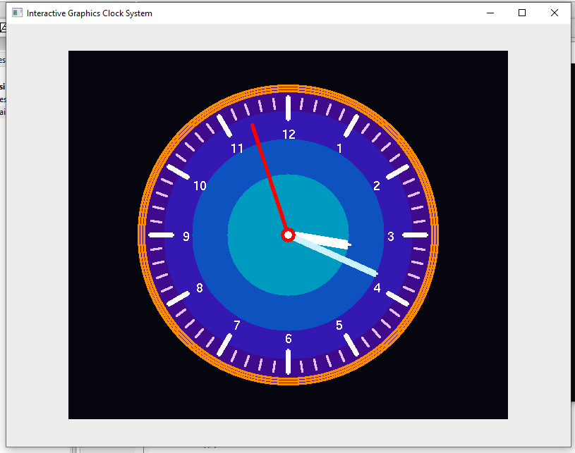
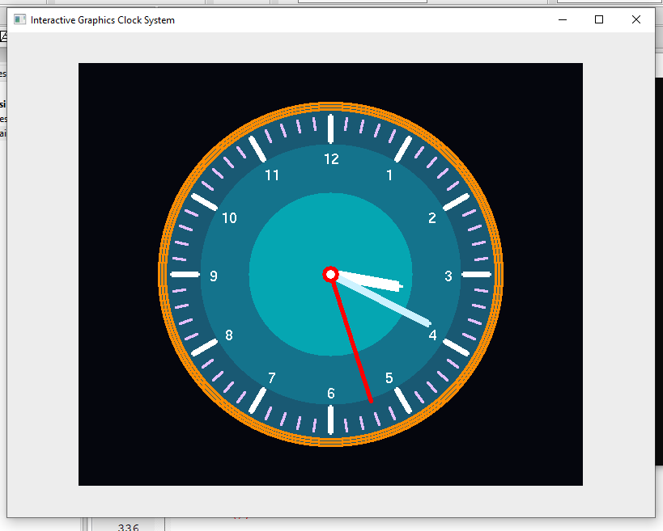

# 🕒 Interactive Graphics Clock System

A real-time analog clock simulation developed using **C++**, **OpenGL**, and **GLUT**, demonstrating the implementation of fundamental Computer Graphics algorithms and interactive graphical rendering techniques.



---

## 📌 Overview

The Interactive Graphics Clock System is a Computer Graphics project that visualizes a fully functional analog clock with real-time updates. The project emphasizes the practical implementation of classic graphics algorithms rather than relying on built-in drawing primitives.

The system renders clock components dynamically and supports multiple visual themes through keyboard interaction.

---

## ✨ Key Features

- Real-time analog clock synchronization
- Interactive theme switching
- Custom clock face rendering
- Dynamic hour, minute, and second hands
- Multiple concentric graphical layers
- Keyboard-based user interaction
- Algorithm-based primitive drawing

---

## 🖥️ Preview

### Theme 1


### Theme 2



---

## 🔧 Graphics Algorithms Implemented

### Bresenham Line Drawing Algorithm
Used for:
- Clock hands
- Minute markings
- Hour markings
- Thick line rendering

### Midpoint Circle Algorithm
Used for:
- Clock boundaries
- Decorative concentric circles

### Scan Conversion Circle Filling
Used for:
- Multi-layer clock face rendering
- Center pivot rendering

---

## 🎮 User Controls

| Key | Action |
|------|---------|
| `1` | Activate Theme 1 |
| `2` | Activate Theme 2 |
| `ESC` | Exit Application |

---

## 🏗️ Project Architecture

```text
Interactive Graphics Clock System
│
├── main.cpp
├── Interactive Graphics Clock System.cbp
│
└── images
    ├── Screenshot_1.png
    └── Screenshot_3.png
```

---

## 🛠️ Technologies Used

| Technology | Purpose |
|------------|---------|
| C++ | Core Programming Language |
| OpenGL | Graphics Rendering |
| GLUT / FreeGLUT | Window Management & Event Handling |
| Code::Blocks | Development Environment |

---

## ⚙️ How to Build and Run

### Windows

1. Install Code::Blocks with MinGW
2. Configure GLUT / FreeGLUT libraries
3. Open:

```text
Interactive Graphics Clock System.cbp
```

4. Build and Run the project

### Linux

```bash
g++ main.cpp -o clock -lGL -lGLU -lglut
./clock
```

---

## 📚 Learning Outcomes

This project demonstrates practical understanding of:

- Computer Graphics Fundamentals
- Raster Graphics Algorithms
- Real-Time Rendering
- Geometric Transformations
- Event-Driven Programming
- OpenGL Graphics Programming

---

## 🚀 Future Improvements

- Digital clock display
- Alarm functionality
- Additional themes
- Smooth hand animation
- Sound effects
- Customizable clock styles

---

## 👨‍💻 Author

**Md. Tausif Uddin**  
B.Sc. in Computer Science & Engineering  
University of Asia Pacific (UAP)

GitHub: https://github.com/tausif112

---

## 📄 License

This project is licensed under the MIT License.
